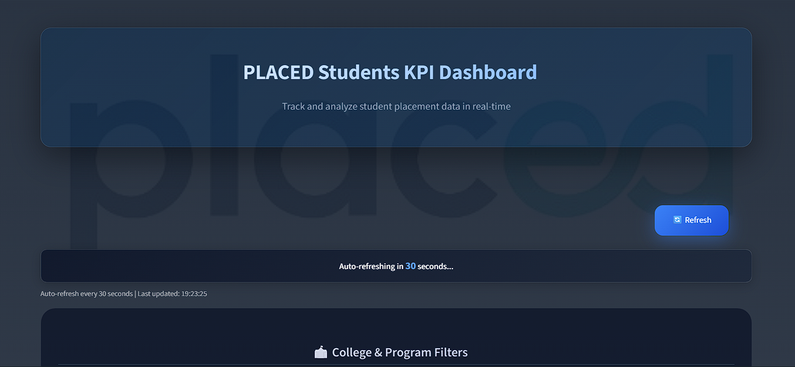
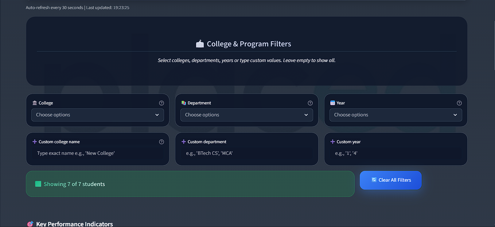

# Dashboard-Placed

A Streamlit-based analytics dashboard for student placement and learning-questionnaire insights.

The app provides two dashboards:

- **Response Dashboard**: aggregated/classification-style insights
- **Student Evaluation Dashboard**: student-level questionnaire analytics with rich charts and filtering

It includes KPI cards, searchable/exportable tables, normalization for consistent categories, and periodic auto-refresh.





---

## Features

### Two dashboard views

- Use the UI toggle ("<<" / ">>") to switch between:
  - **Response Dashboard**
  - **Student Evaluation Dashboard**

### Student Evaluation filters

- Filter by **College**, **Department**, and **Year**
- Supports **custom text inputs** (exact value normalization + contains-based matching)
- **Clear All Filters** button
- Shows a **filter summary** and a “no results” warning when nothing matches

### Normalization

- Canonical normalization for spelling variants of:
  - `college_name`
  - `department`
- Implemented via canonical maps in `filters/college_dept_map.py` and applied during data fetch.

### Visualizations & analytics

Student Evaluation view provides rich Plotly charts and score analytics when available, including:

- Sunburst (College → Department → Year)
- Pie charts (e.g., medium, career goal)
- Grouped bar charts (career goals vs prep-test)
- Stacked bar (learning seek-answer profile)
- Bubble chart (teaching style fit)
- Donuts (content vs engagement)
- Score analytics (only when score columns like `final_score` are present)

### KPIs

When `final_score` exists after filtering, KPIs include:

- Total Students
- Average score metrics (Quant/Logic/Verbal/Final)
- Tier counts (e.g., `final_score >= 75`, `final_score >= 45`)
- #1 performer (top final score)

### Student table + export

- Student data table with selection/filtering
- **Filter by Student ID** (if `student_id` column exists)
- **Export CSV** of the filtered dataset

### Auto-refresh

- The dashboard refreshes every `REFRESH_SECONDS` (default: **30s**)
- Includes a manual **Refresh** button that clears caches and triggers a rerun

### Custom styling

- Styling and custom HTML/JS are loaded from `frontend/`

---

## Tech Stack

| Category        | Technology                                                               |
| --------------- | ------------------------------------------------------------------------ |
| Frontend / UI   | Streamlit                                                                |
| Data processing | Pandas                                                                   |
| Visualizations  | Plotly (Plotly Express)                                                  |
| Data source     | Supabase (default) or Local CSV (optional)                               |
| Supabase access | Supabase REST API via a minimal custom client (no external supabase SDK) |
| Authentication  | Supabase JWT via env vars `SUPABASE_URL`, `SUPABASE_KEY`                 |

---

## Repository Layout

```
Dashboard-Placed/
├── app.py
├── constants.py
├── deployment.yaml
├── Dockerfile
├── requirements.txt
├── services.yaml
├── wake.py
├── README.md
├── data/
│   ├── __init__.py
│   ├── data.py
│   └── backups/
│       ├── BACKUPS.md
│       ├── CLASSIFICATION.csv
│       └── STUDENT_DATA.csv
├── filters/
│   ├── __init__.py
│   ├── filter.py              # main filter + normalization + score analytics + export
│   ├── student_dashboard.py   # Student Evaluation tab rendering
│   ├── college_dept_map.py    # canonical spelling maps
│   └── questionnaire_instruct_map.py
├── form/
│   ├── __init__.py
│   ├── sync.py                # one-time CSV → Supabase sync utilities
│   └── backup.py
├── frontend/
│   ├── styles.py
│   ├── script.js
│   ├── countdown.html
│   ├── css/
│   └── js/
├── queries/
│   ├── db_queries.py         # fetch/insert with Streamlit caching
│   └── supabase_client.py    # minimal REST client
└── Resources/
    ├── Dashboard.png
    ├── Dashboard2.png
    ├── Drawer.png
    ├── LOGO.png
    ├── Placed.jpg
    └── Profiling questionnaire.docx
```

---

## Containerization & Deployment (Docker + Kubernetes)

The repo supports containerization for the dashboard and related services.

### Docker

Build images from the repository root:

```bash
docker build -t dashboard-placed:latest .
docker build -t dashboard-placed-frontend:latest ./frontend
docker build -t dashboard-placed-form:latest ./form
```

### Kubernetes

Kubernetes resources are defined in `deployment.yaml` (and related manifests such as `services.yaml`).

---

## Getting Started

### Prerequisites

- Python 3.8+
- Supabase project (default data source)
- Environment variables:
  - `SUPABASE_URL`
  - `SUPABASE_KEY`

Local CSV testing is supported via `USE_CSV = True` in `constants.py`.

### Installation

```bash
git clone https://github.com/Ak47xdd/Dashboard-Placed.git
cd Dashboard-Placed

python -m venv venv
venv\Scripts\activate  # Windows
# source venv/bin/activate  # macOS/Linux

pip install -r requirements.txt
```

### Configure `constants.py`

Key settings:

| Constant          | Description                              | Default                              |
| ----------------- | ---------------------------------------- | ------------------------------------ |
| `REFRESH_SECONDS` | Auto-refresh interval                    | `30`                                 |
| `USE_CSV`         | Toggle local CSV vs Supabase             | `False`                              |
| `MAIN_CSV`        | Local student dataset base name          | `"STUDENTS - Sheet1"`                |
| `CSV_FILE`        | Local classification dataset base name   | `"CLASSIFICATIONS - Sheet1 (1).csv"` |
| `SUPA_DB`         | Supabase table for classification        | `"CLASSIFICATION"`                   |
| `SUPA_RAW_DB`     | Supabase table for student raw responses | `"STUDENT_DATA"`                     |

### Running the App

```bash
streamlit run app.py
```

Local URL: `http://localhost:8501`

---

## How Data Flows

1. **Startup**: `frontend/styles.py` loads CSS/HTML/JS and configures the Streamlit page.
2. **Mode selection**: `app.py` chooses the view:
   - `Response Dashboard` → `view="classification"`
   - `Student Evaluation Dashboard` → `view="raw"`
3. **Data loading**: `data/data.py:load_data(view=...)`
   - If `USE_CSV=True`, reads from `data/backups/*.csv`
   - Otherwise loads from Supabase via `queries/db_queries.py`
4. **Normalization**: applied in fetch functions (cached) using canonical maps.
5. **Filtering + export**: `filters/filter.py` renders filters, KPIs, analytics, and exports.

---

## Expected Columns

The dashboard expects different fields depending on which dataset is loaded.

### Student Evaluation (raw `STUDENT_DATA`) includes (examples)

- Identity / grouping:
  - `student_id`, `student_name`
  - `college_name`, `department`, `course_type`, `year`
  - `medium`
- Placement/goal:
  - `career_goal`
  - `have_prep_test`
- Questionnaire fields (examples used by charts):
  - `learn_Q1`
  - `instruct_Q1` … `instruct_Q6`
  - `content_pref_Q1`
  - `engage_Q1`, `engage_Q3`, `engage_Q4`
  - `commit_Q2`, `commit_Q4`
- Score analytics (if available):
  - `quant_score`, `logic_score`, `verbal_score`, `final_score`

### Response / Classification dataset (`CLASSIFICATION`)

The Response Dashboard is driven by the classification table. Column names depend on how the classification rows were created.

---

## Auto-Refresh + Manual Refresh

- `app.py` shows a **Refresh** button that clears Streamlit caches (`st.cache_data.clear()`) and removes cached DataFrames from `st.session_state`.
- `frontend/styles.py:auto_refresh()` displays a countdown UI.

---

## One-time Supabase Sync Utilities (form/)

The `form/` folder contains helpers for syncing CSVs into Supabase (typically used once to populate tables):

- `form/sync.py`
  - `sync_STUDENT_csv_to_supabase()` → pushes `./data/STUDENTS - Sheet1.csv` into `STUDENT_DATA`
  - `sync_CLASS_csv_to_supabase()` → pushes `./data/CLASSIFICATIONS - Sheet1 (1).csv` into `CLASSIFICATION`

---

## Troubleshooting

### Supabase authentication errors

- Verify `SUPABASE_URL` and `SUPABASE_KEY` are correct.
- Ensure the Supabase table permissions allow SELECT/INSERT for the configured key.

### Charts missing / data not loading

- The Student Evaluation view shows informational messages when expected questionnaire/score columns are missing.
- Confirm your dataset column names match what the dashboard references.

### Auto-refresh issues

- Some browsers restrict background updates.
- Use the manual **Refresh** button.

---

## License

MIT License. See `LICENSE` for details.

---

## Acknowledgments

- Streamlit
- Plotly
